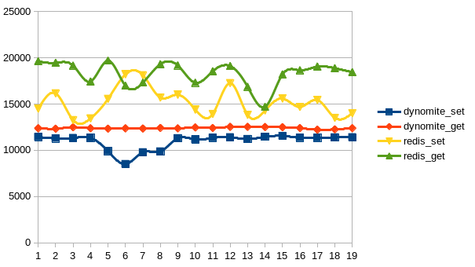

# dynomite

## Note

redis : <https://github.com/Netflix/dynomite/blob/dev/notes/redis.md>

recommendation : <https://github.com/Netflix/dynomite/blob/dev/notes/recommendation.md>

memcache : <https://github.com/Netflix/dynomite/blob/dev/notes/memcache.txt>

## 调用链


## 安装

```bash
$ git clone git@github.com:Netflix/dynomite.git
$ cd dynomite
$ git checkout v0.6.2
$ autoreconf -fvi
$ ./configure --enable-debug=yes
$ make
$ src/dynomite -h
```

## 配置(conf/dynomite.yml)

* env

  定义节点环境类型, 支持aws/network, network用于自建环境

* datacenter

  定义数据中心的名字

* rack 

  机架名称(应该是类似AZ的概念)

* dyn_listen 

  监听端口,用于节点间内部沟通以及gossip协议

* enable_gossip 
  
  使用gossip代替静态令牌的集群管理, gossip是实验性的,不推荐使用

* gos_interval 

  gossip协议检测周期

* tokens

  当前节点的令牌

* dyn_seed_provider

  seed 提供者

* dyn_seeds

  seed节点列表, 格式 : address:port:rack:dc:tokens

* listen
  
  对外服务监听地址, 格式 : name:port / ip:port

* timeout

  server与server之间的连接建立超时时间(毫秒值)

* preconnect=

  是否在启动时建立到所有server端的连接, 默认为false

* data_store

  存储服务提供类型, 0-redis, 1-memcached, 默认为 0

* auto_eject_hosts

  当对端server频繁的连接失败时, 是否临时拒绝它的连接请求,默认为false

* server_retry_timeout

  当 auto_eject_host 设置为true时, 重新接受临时拒绝server的超时时间(毫秒值), 默认为30000

* server_failure_limit

  当 auto_eject_host 设置为true时, 当某个 server 连续失败 server_failure_limit 设置的次数后, 将临时拒绝对应server的连接请求

* servers

  本地server列表, 格式为 : name:port:weight 或 ip:port:weight

* secure_server_option

  server之间通信加密类型, 可选值为 none/rack/datacenter/all.

  * all 所有node之间都使用加密
  * datacenter 所有的datacenter之间通信是加密的, datacenter内部不是加密的.
  * rack 所有rack之间通信是加密的, 但是rack内部通信不是加密的.
  * none 所有通信都不加密

* stats_listen
 
  统计restapi监听地址,格式 name:port 或 ip:port

* stats_interval

  状态统计周期(毫秒值), 默认为30000

* mbuf_size

  mbuf chunk 字节大小, 单位byte, 默认 16384 bytes

* max_msgs
  
  消息调度的数量, 默认为200000


## 单机性能测试对比

### python


### redis-benchmark against redis-server

```bash
src/redis-benchmark -h 127.0.0.1 -q -t set,get,incr,lpush,lpop,sadd,spop,lpush,lrange -c 100 -p 6379
SET: 201207.23 requests per second
GET: 215982.72 requests per second
INCR: 220264.31 requests per second
LPUSH: 224215.23 requests per second
LPOP: 221729.48 requests per second
SADD: 220750.55 requests per second
SPOP: 218340.61 requests per second
LPUSH (needed to benchmark LRANGE): 223214.28 requests per second
LRANGE_100 (first 100 elements): 76511.09 requests per second
LRANGE_300 (first 300 elements): 29036.00 requests per second
LRANGE_500 (first 450 elements): 20424.84 requests per second
LRANGE_600 (first 600 elements): 14967.82 requests per second  
```

### redis-benchmark against dynomite proxing redis-server


```bash
src/redis-benchmark -h 127.0.0.1 -q -t set,get,incr,lpush,lpop,sadd,spop,lpush,lrange -c 100 -p 8000
SET: 154083.20 requests per second
GET: 177619.89 requests per second
INCR: 175131.36 requests per second
LPUSH: 177935.95 requests per second
LPOP: 165289.25 requests per second
SADD: 175438.59 requests per second
SPOP: 177935.95 requests per second
LPUSH (needed to benchmark LRANGE): 173913.05 requests per second
LRANGE_100 (first 100 elements): 50530.57 requests per second
LRANGE_300 (first 300 elements): 19204.92 requests per second
LRANGE_500 (first 450 elements): 12740.48 requests per second
LRANGE_600 (first 600 elements): 8784.26 requests per second
```
